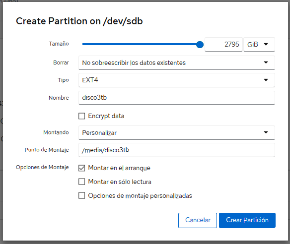
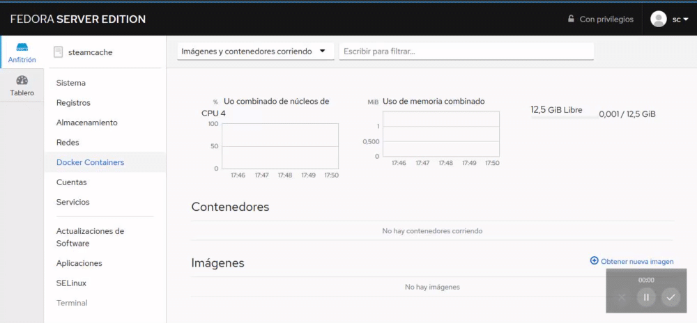
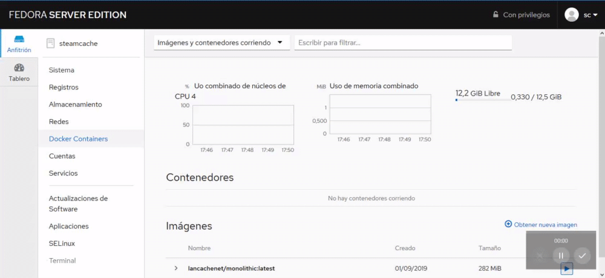
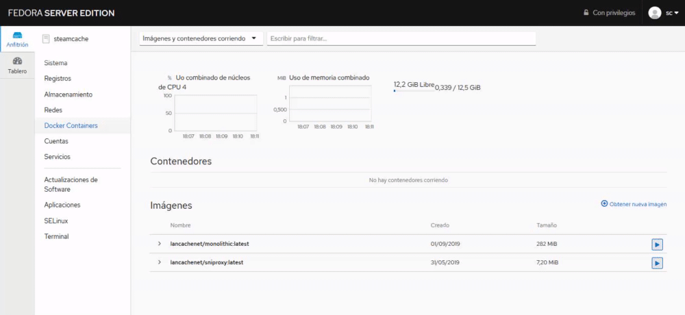
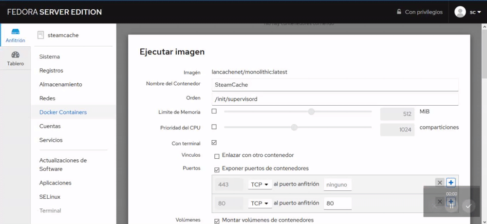
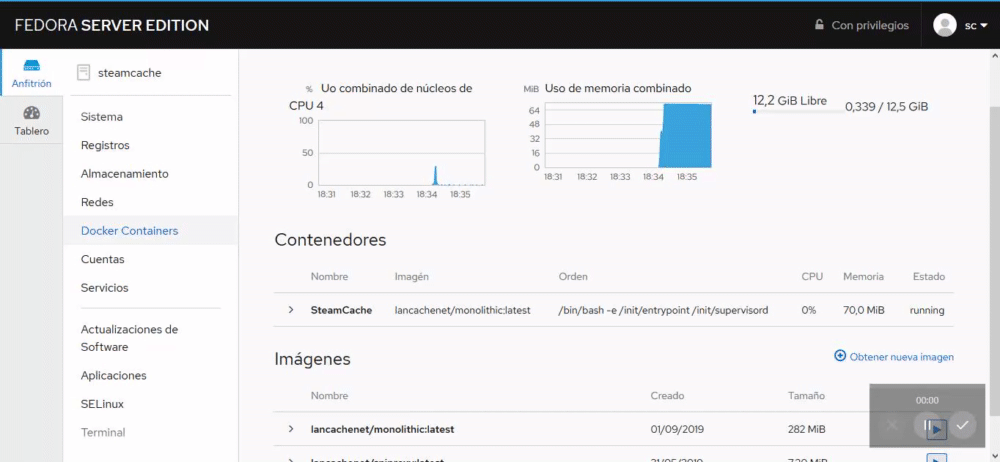
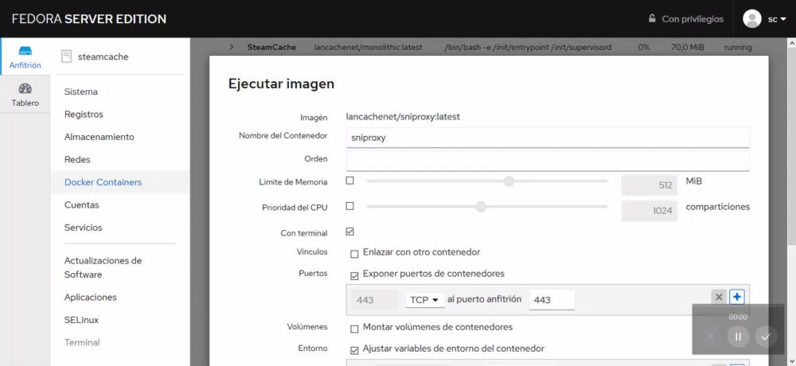

# Cómo instalar SteamCache en Linux (Fedora Server 30)

_En este caso usaré Fedora Server 30_

## Comenzando 🚀

_Para poder comenzar lo que tendreis que hacer es descargaros [Fedora Server 30](https://download.fedoraproject.org/pub/fedora/linux/releases/30/Server/x86_64/iso/Fedora-Server-dvd-x86_64-30-1.2.iso), y [Rufus](https://rufus.ie/es_ES.html) para montar un USB para instalar Fedora en el servidor._

## Pre-requisitos 📋

_Nuestro SteamCache tiene los siguientes componentes:_

* Xeon E5430
* 8 GB de RAM
* 500 GB HDD
* 3 TB HDD, exclusivo para almacenar los juegos.

## Instalación 🔧

_A continuación vamos a ver los pasos que tenemos que seguir para realizar una correcta instalación._

_**Primer paso:** Instalar Fedora en el servidor siguiendo el asistente, antes de ello tenemos que montar la ISO de Fedora en el USB a través de Rufus_

1. Pinchamos el USB en el PC y lo abrimos.
2. Install Fedora 30
3. Seleccionamos idioma y le damos a continuar
4. Elegimos el destino de instalación, dentro seleccionamos el disco y le damos a siguiente.
5. Pulsamos sobre "Eliminar todo" y reclamar espacio.
6. Y pulsamos sobre empezar instalación.
7. Ponemos el nombre del equipo, en nuestro caso, steamcache y le damos a comenzar.
8. Completamos los datos que nos piden. Y esperamos a que la instalación finalice.


_**Segundo paso:** Desinstalamos versiones anteriores de DOCKER_

```
sudo dnf remove docker \
                docker-client \
                docker-client-latest \
                docker-common \
                docker-latest \
                docker-latest-logrotate \
                docker-logrotate \
                docker-selinux \
                docker-engine-selinux \
                docker-engine
```

_**Tercer paso:** Instalamos DOCKER_

```
sudo dnf -y install dnf-plugins-core

sudo dnf config-manager --add-repo https://download.docker.com/linux/fedora/docker-ce.repo

sudo dnf install docker-ce docker-ce-cli containerd.io

sudo usermod -aG docker sc
```

_**Cuarto paso:** Finalizamos la instalación_

```
sudo usermod -aG docker sc
sudo systemctl enable docker
```
Donde sc es el usuario con el que queremos ejecutar docker


_**Quinto paso:** Reiniciamos el servidor y hacemos la prueba_

```
docker run hello-world
```

_**Sexto paso:** Instalamos COCKPIT. Una vez instalado volvemos a reiniciar el servidor_

```
sudo dnf install cockpit-docker
```

_**Séptimo paso:** Abrimos nuestro navegador y ponemos la IP del servidor seguido del puerto 9090._

_**Octavo paso:** Vamos a la pestaña "Almacenamiento", hacemos click sobre "Crear particion" y ponemos los siguientes datos._



Despues de montarlo tecleamos los siguientes códigos

```
cd /media/disco3tb
sudo mkdir -p data/cache
sudo chown sc:sc data/cache
sudo mkdir -p data/logs
sudo chown sc:sc data/logs
```

_**Noveno paso:** Vamos a la pestaña "Docker Containers", hacemos click sobre "Obtener nueva imagen", buscamos "lancachenet/monolithic" y la descargamos._



_**Décimo paso:** Vamos a la pestaña "Docker Containers", hacemos click sobre "Obtener nueva imagen", buscamos "lancachenet/sniproxy y la descargamos._



_**Undécimo paso:** Vamos a la pestaña "Docker Containers", y hacemos click en el boton de start del contenedor "lancachenet/monolithic"_



_Posteriormente pondremos las siguientes opciones. En UPSTREAM_DNS pondremos la IP del servidor DNS. En la normativa de reinicio pondremos "A MENOS QUE SEA DETENIDO" nunca "SIEMPRE", si no, no podremos apagar el contenedor. Y pulsamos en ejecutar_



_**Duodécimo paso:** Vamos a la pestaña "Docker Containers", y hacemos click en el boton de start del contenedor "lancachenet/sniproxy"_



_Posteriormente pondremos las siguientes opciones. En UPSTREAM_DNS pondremos la IP del servidor DNS. En la normativa de reinicio pondremos "A MENOS QUE SEA DETENIDO" nunca "SIEMPRE", si no, no podremos apagar el contenedor. Y pulsamos en ejecutar_



**Las peticiones a realizar al servidor de STEAM se deberán apuntar hacia este servidor.**

## Autores ✒️

* **Andrés Ruz Nieto** - *Documentación* - [aruznieto](https://github.com/aruznieto) 
* **Rafael García Tristante** - *Documentación* - [TheMrRafus](https://github.com/TheMrRafus) 

## Expresiones de Gratitud 🎁

* Comenta a otros sobre este proyecto 📢
* Invita una cerveza 🍺 a alguien del equipo. 
* Da las gracias públicamente 🤓.
* etc.

---
⌨️ con ❤️ por [aruznieto](https://github.com/aruznieto) y [TheMrRafus](https://github.com/TheMrRafus) 😊
